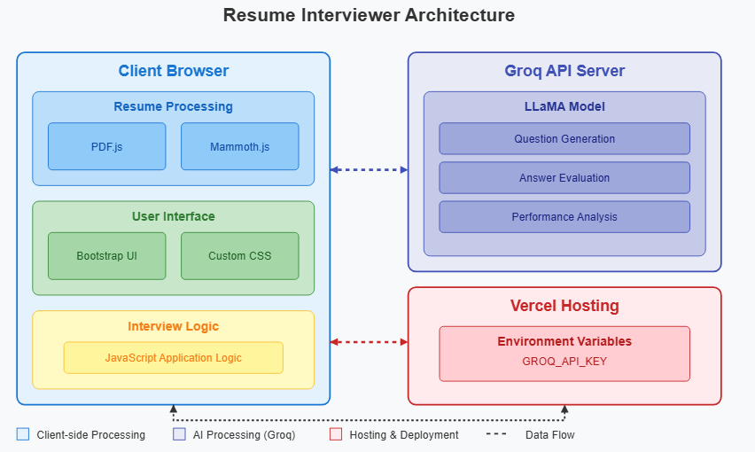

# Resume Interviewer - AI-Powered Mock Interview Platform

## Overview

Resume Interviewer is an AI-powered mock interview platform that generates personalized interview questions based on your resume. This tool helps job seekers practice for interviews by providing real-time feedback on their answers and a comprehensive performance summary.

**This project was designed and coded in half a day with the assistance of AI tools.**

## Features

- **Resume Analysis**: Upload your resume in PDF, DOCX, or TXT format
- **Personalized Questions**: Get interview questions tailored to your skills and experience
- **AI Feedback**: Receive constructive feedback on your answers
- **Performance Summary**: Get a detailed assessment of your interview performance
- **Privacy-Focused**: All processing happens in your browser - your data never leaves your computer

## Architecture



### System Architecture

```
┌─────────────────────────────────┐      ┌─────────────────────┐
│                                 │      │                     │
│  Client Browser                 │      │  Groq API Server    │
│  ┌───────────────────────────┐  │      │                     │
│  │                           │  │      │  ┌───────────────┐  │
│  │  Resume Upload & Parsing  │  │      │  │ LLaMA Model   │  │
│  │  ┌─────────────────────┐  │  │      │  │               │  │
│  │  │ PDF.js / Mammoth.js │  │  │      │  │  Question     │  │
│  │  └─────────────────────┘  │  │      │  │  Generation   │  │
│  │                           │  │      │  │               │  │
│  │  User Interface           │◄─┼──────┼─►│  Answer       │  │
│  │  ┌─────────────────────┐  │  │      │  │  Evaluation   │  │
│  │  │ Bootstrap / Custom  │  │  │      │  │               │  │
│  │  │ CSS                 │  │  │      │  │  Performance  │  │
│  │  └─────────────────────┘  │  │      │  │  Analysis     │  │
│  │                           │  │      │  │               │  │
│  │  Interview Logic          │  │      │  └───────────────┘  │
│  │  ┌─────────────────────┐  │  │      │                     │
│  │  │ JavaScript          │  │  │      └─────────────────────┘
│  │  └─────────────────────┘  │  │
│  │                           │  │      ┌─────────────────────┐
│  └───────────────────────────┘  │      │                     │
│                                 │      │  Vercel Hosting     │
│                                 │◄─────┤                     │
└─────────────────────────────────┘      │  ┌───────────────┐  │
                                         │  │ Environment   │  │
                                         │  │ Variables     │  │
                                         │  └───────────────┘  │
                                         │                     │
                                         └─────────────────────┘
```

### Data Flow

1. User uploads resume to the browser
2. Client-side JavaScript extracts text from the resume
3. Extracted text and job details are sent to Groq API
4. Groq generates personalized interview questions
5. User answers questions one by one
6. Each answer is sent to Groq for evaluation
7. AI provides feedback on each answer
8. After all questions, Groq generates a performance summary
9. User can restart or download their results

## Technology Stack

- **Frontend**: HTML5, CSS3, JavaScript
- **UI Framework**: Bootstrap 5
- **Document Processing**: PDF.js, Mammoth.js
- **AI Backend**: Groq API with LLaMA model
- **Deployment**: Vercel

## Setup and Deployment

### Prerequisites

- Groq API key from [console.groq.com/keys](https://console.groq.com/keys)
- GitHub account (for deployment)
- Vercel account (for hosting)

### Local Development

1. Clone the repository
2. Open index.html in your browser or use a local server:
   ```
   npx serve
   ```
3. Enter your Groq API key when prompted

### Deployment to Vercel

1. Push your code to GitHub
2. Connect your repository to Vercel
3. Add your Groq API key as an environment variable (GROQ_API_KEY)
4. Deploy!

## Project Structure

```
resume-interviewer/
├── index.html      # Main HTML file
├── styles.css      # CSS styling
├── script.js       # Main application logic
├── vercel.json     # Vercel configuration
└── api/
    └── env.js      # Environment variables handler
```

## Limitations

- Only supports English language resumes
- Limited file size (max 5MB)
- Requires Groq API key (free tier available)
- Internet connection required for AI functionality

## Future Enhancements

- Multi-language support
- Video recording of interview sessions
- Industry-specific question templates
- Mock video interviews with AI avatar
- Interview scheduling with reminder notifications

## License

MIT License

## Acknowledgements

This project was created with the assistance of Claude AI from Anthropic. The design, architecture, and code were developed collaboratively in half a day to demonstrate the potential of AI-assisted development.

The application uses several open-source libraries:
- PDF.js from Mozilla
- Mammoth.js for DOCX processing
- Bootstrap for UI components

---

Made with ❤️ and AI